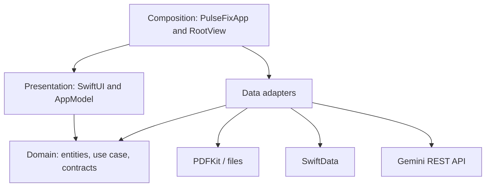
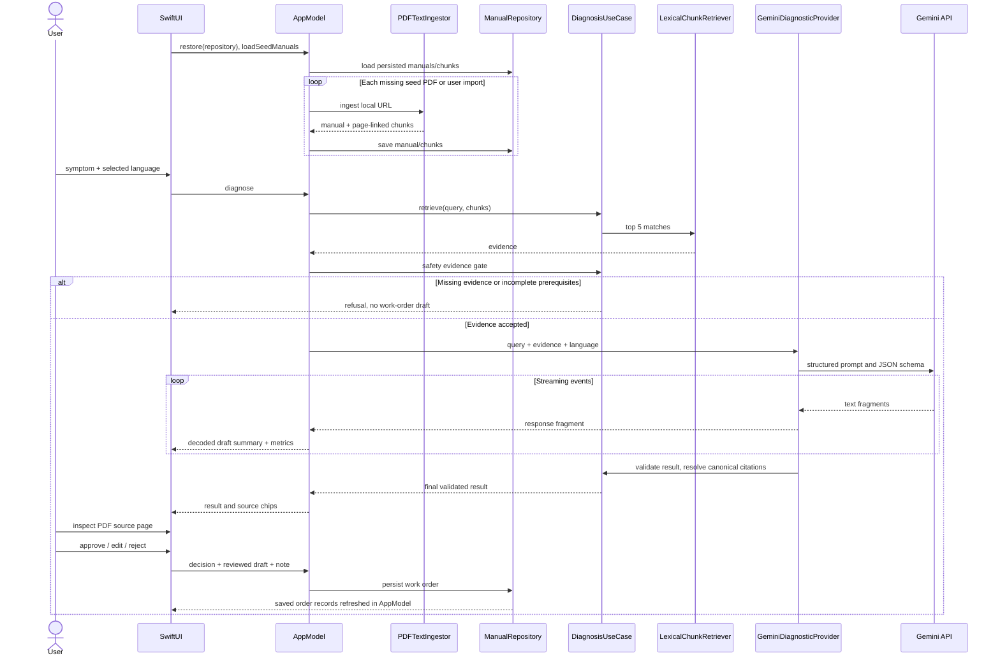

# Architecture and design

## Boundaries

- **Domain:** Foundation-only data types, service contracts, repository contract, and `DiagnosisUseCase` (retrieval orchestration, refusal policy, canonical citations, result validation). No SwiftUI, SwiftData, PDFKit or Gemini SDK dependency.
- **Data:** PDFKit ingestion, lexical search, Gemini REST transport, SwiftData models and repository implementation. Implements Domain contracts.
- **Presentation / App:** SwiftUI screens and observable `AppModel`. The model depends on Domain service/repository contracts, and owns view state, language invalidation, request timing and progress. Views display state and send user intents.
- **Composition:** `PulseFixApp` constructs concrete ingestion/search/provider services. `RootView` binds the SwiftData repository from the environment context during startup. `WorkOrdersView` reads Domain work-order records from AppModel; both reads and writes go through the repository contract.

## Layer diagram (arrows mean depends on)

## Data flow sequence diagram

## State and identity

A language revision UUID invalidates responses after any language switch, including English → Arabic → English. Navigation is rebuilt for locale/direction updates. Generated results are cleared rather than silently translated. PDF lookup uses the cited chunk's manual UUID; names are display labels only.

## Storage and trust

PDF/TXT files are copied into Application Support/Manuals. SwiftData stores manual metadata, chunks and human work-order decisions. Saving fails atomically with repository rollback. Repeated startup does not reimport an existing seed filename. A safety gate is an evidence-format heuristic; human review remains required, and the app has no machinery-control capability or authenticated supervisor role.

The provider treats retrieved material as untrusted data in the prompt. It rejects unknown source IDs and derives reference metadata locally. Empty/unsupported grounded responses are rejected; negative statuses are normalized to refusal with no actions. Streaming summaries remain marked as draft until validation; they are not a verified diagnosis.

## Observability

Localized event labels, retrieved chunk count, full prompt character count (query + instructions + evidence, excluding transport JSON/schema), response character count, time to first text, total elapsed response time and average response characters/second are visible in Trace Inspector. Character throughput includes JSON transport text and total request latency; it is not model tokens/second. History is session-only.
